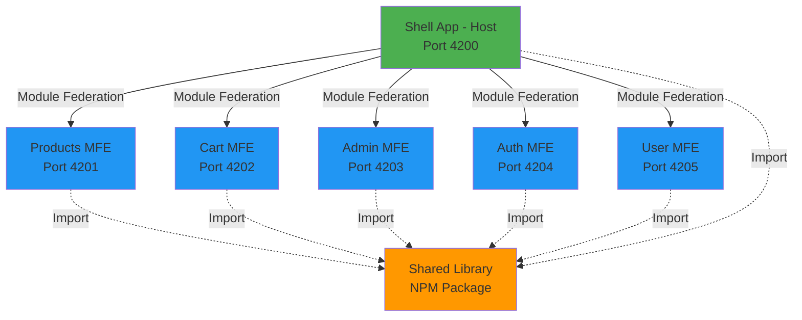

# Design Document - Angular MFE Transformation

## Overview

This design document outlines the technical architecture for transforming the monolithic CoffeeWorkshop Angular 21 application into a Micro Frontend (MFE) architecture using Webpack 5 Module Federation. The transformation decomposes the monolith into six independent applications (one Shell and five MFEs) plus a shared library, enabling independent development, testing, and deployment while maintaining all existing functionality.

### Design Goals

1. **Independent Deployment**: Each MFE can be deployed independently without rebuilding other MFEs
2. **Autonomous Development**: Teams can work on different MFEs simultaneously without conflicts
3. **Scalability**: New features can be added as new MFEs without modifying existing ones
4. **Performance**: Maintain or improve current application performance through lazy loading and code splitting
5. **Maintainability**: Clear separation of concerns with well-defined boundaries between MFEs
6. **Zero Downtime Migration**: Enable gradual migration with rollback capabilities

### High-Level Architecture

The architecture consists of:

- **Shell App** (Host): Orchestrates the application, manages routing, core services, and shared state
- **Products MFE** (Remote): Product catalog and product detail views
- **Cart MFE** (Remote): Shopping cart functionality
- **Admin MFE** (Remote): Administrative dashboard and product management
- **Auth MFE** (Remote): Authentication and authorization flows
- **User MFE** (Remote): User profile and settings management
- **Shared Library**: Common components, pipes, directives, validators, and utilities



## Architecture

### Module Federation Architecture

Module Federation enables runtime composition of separately built and deployed applications. The Shell App acts as the host, dynamically loading remote MFEs at runtime based on routing.

#### Host Configuration (Shell App)

The Shell App configures Module Federation as a host that consumes remote modules:

```typescript
// webpack.config.js (Shell App)
const ModuleFederationPlugin = require('webpack/lib/container/ModuleFederationPlugin');

module.exports = {
  plugins: [
    new ModuleFederationPlugin({
      name: 'shell',
      remotes: {
        products: 'products@http://localhost:4201/remoteEntry.js',
        cart: 'cart@http://localhost:4202/remoteEntry.js',
        admin: 'admin@http://localhost:4203/remoteEntry.js',
        auth: 'auth@http://localhost:4204/remoteEntry.js',
        user: 'user@http://localhost:4205/remoteEntry.js',
      },
      shared: {
        '@angular/core': { singleton: true, strictVersion: false, requiredVersion: '21.1.0' },
        '@angular/common': { singleton: true, strictVersion: false, requiredVersion: '21.1.0' },
        '@angular/router': { singleton: true, strictVersion: false, requiredVersion: '21.1.0' },
        '@angular/material': { singleton: true, strictVersion: false, requiredVersion: '21.1.5' },
        '@ngrx/store': { singleton: true, strictVersion: false, requiredVersion: '21.0.1' },
        '@ngrx/effects': { singleton: true, strictVersion: false, requiredVersion: '21.0.1' },
        rxjs: { singleton: true, strictVersion: false, requiredVersion: '7.8.0' },
      },
    }),
  ],
};
```

#### Remote Configuration (MFEs)

Each MFE configures Module Federation as a remote that exposes its modules:

```typescript
// webpack.config.js (Products MFE example)
const ModuleFederationPlugin = require('webpack/lib/container/ModuleFederationPlugin');

module.exports = {
  plugins: [
    new ModuleFederationPlugin({
      name: 'products',
      filename: 'remoteEntry.js',
      exposes: {
        './Routes': './src/app/products.routes.ts',
      },
      shared: {
        '@angular/core': { singleton: true, strictVersion: false, requiredVersion: '21.1.0' },
        '@angular/common': { singleton: true, strictVersion: false, requiredVersion: '21.1.0' },
        '@angular/router': { singleton: true, strictVersion: false, requiredVersion: '21.1.0' },
        '@angular/material': { singleton: true, strictVersion: false, requiredVersion: '21.1.5' },
        '@ngrx/store': { singleton: true, strictVersion: false, requiredVersion: '21.0.1' },
        '@ngrx/effects': { singleton: true, strictVersion: false, requiredVersion: '21.0.1' },
        rxjs: { singleton: true, strictVersion: false, requiredVersion: '7.8.0' },
      },
    }),
  ],
  output: {
    publicPath: 'auto',
    uniqueName: 'products',
  },
};
```

### Repository Structure

Each MFE resides in its own standalone Git repository for independent version control and CI/CD:

```
coffee-workshop-shell/          (Shell App - existing CoffeeWorkshop repo)
├── src/
│   ├── app/
│   │   ├── core/               (guards, interceptors, services)
│   │   ├── layout/             (header, footer)
│   │   └── app.routes.ts       (Module Federation route loading)
│   └── environments/
├── webpack.config.js
└── package.json

coffee-products-mfe/            (Products MFE)
├── src/
│   ├── app/
│   │   ├── components/         (ProductCard, ProductForm)
│   │   ├── pages/              (ProductListPage, ProductDetailPage, ProductCreatePage)
│   │   ├── repositories/       (ProductRepository)
│   │   ├── store/              (ProductState, ProductActions, ProductSelectors, ProductEffects)
│   │   └── products.routes.ts
│   └── bootstrap.ts
├── webpack.config.js
└── package.json

coffee-cart-mfe/                (Cart MFE)
├── src/
│   ├── app/
│   │   ├── pages/              (CartPage)
│   │   ├── store/              (CartState, CartActions, CartSelectors)
│   │   └── cart.routes.ts
│   └── bootstrap.ts
├── webpack.config.js
└── package.json

coffee-admin-mfe/               (Admin MFE)
├── src/
│   ├── app/
│   │   ├── pages/              (AdminDashboardPage, AdminProductsPage, AdminProductFormPage)
│   │   └── admin.routes.ts
│   └── bootstrap.ts
├── webpack.config.js
└── package.json

coffee-auth-mfe/                (Auth MFE)
├── src/
│   ├── app/
│   │   ├── pages/              (LoginPage, RegisterPage)
│   │   ├── store/              (AuthState, AuthActions, AuthSelectors, AuthEffects)
│   │   └── auth.routes.ts
│   └── bootstrap.ts
├── webpack.config.js
└── package.json

coffee-user-mfe/                (User MFE)
├── src/
│   ├── app/
│   │   ├── pages/              (ProfilePage, SettingsPage)
│   │   ├── store/              (UserState, UserActions, UserSelectors, UserEffects)
│   │   └── user.routes.ts
│   └── bootstrap.ts
├── webpack.config.js
└── package.json

coffee-shared-lib/              (Shared Library)
├── projects/
│   └── coffee-shared/
│       ├── src/
│       │   ├── lib/
│       │   │   ├── components/     (FormError, Input, ConfirmDialog)
│       │   │   ├── directives/     (ClickOutside, LazyLoad, DebounceClick, AutoFocus)
│       │   │   ├── pipes/          (SafeHtml, TimeAgo, Truncate, Filter, Highlight)
│       │   │   ├── validators/     (CustomValidators)
│       │   │   ├── utils/          (DateUtils, StringUtils, ArrayUtils)
│       │   │   ├── models/         (ApiResponse, User)
│       │   │   └── enums/          (OrderStatus, PaymentMethod)
│       │   └── public-api.ts
│       └── package.json
└── package.json
```

### Routing Strategy

The Shell App uses Angular's lazy loading with `loadRemoteModule` to dynamically load MFE routes:

```typescript
// app.routes.ts (Shell App)
import { loadRemoteModule } from '@angular-architects/module-federation';
import { Routes } from '@angular/router';
import { authGuard } from './core/guards/auth.guard';
import { roleGuard } from './core/guards/role.guard';

export const routes: Routes = [
  { path: '', redirectTo: '/products', pathMatch: 'full' },
  {
    path: 'products',
    loadChildren: () =>
      loadRemoteModule({
        type: 'module',
        remoteEntry: 'http://localhost:4201/remoteEntry.js',
        exposedModule: './Routes',
      }).then((m) => m.PRODUCT_ROUTES),
  },
  {
    path: 'cart',
    loadChildren: () =>
      loadRemoteModule({
        type: 'module',
        remoteEntry: 'http://localhost:4202/remoteEntry.js',
        exposedModule: './Routes',
      }).then((m) => m.CART_ROUTES),
  },
  {
    path: 'admin',
    canActivate: [authGuard, roleGuard],
    data: { roles: ['ADMIN'] },
    loadChildren: () =>
      loadRemoteModule({
        type: 'module',
        remoteEntry: 'http://localhost:4203/remoteEntry.js',
        exposedModule: './Routes',
      }).then((m) => m.ADMIN_ROUTES),
  },
  {
    path: 'auth',
    loadChildren: () =>
      loadRemoteModule({
        type: 'module',
        remoteEntry: 'http://localhost:4204/remoteEntry.js',
        exposedModule: './Routes',
      }).then((m) => m.AUTH_ROUTES),
  },
  {
    path: 'user',
    canActivate: [authGuard],
    loadChildren: () =>
      loadRemoteModule({
        type: 'module',
        remoteEntry: 'http://localhost:4205/remoteEntry.js',
        exposedModule: './Routes',
      }).then((m) => m.USER_ROUTES),
  },
  { path: '**', redirectTo: '/products' },
];
```

#### Environment-Specific Remote URLs

Remote URLs are configured via environment variables for different deployment environments:

```typescript
// environment.ts (Development)
export const environment = {
  production: false,
  remotes: {
    products: 'http://localhost:4201/remoteEntry.js',
    cart: 'http://localhost:4202/remoteEntry.js',
    admin: 'http://localhost:4203/remoteEntry.js',
    auth: 'http://localhost:4204/remoteEntry.js',
    user: 'http://localhost:4205/remoteEntry.js',
  },
};

// environment.prod.ts (Production)
export const environment = {
  production: true,
  remotes: {
    products: 'https://cdn.coffeeworkshop.com/products/remoteEntry.js',
    cart: 'https://cdn.coffeeworkshop.com/cart/remoteEntry.js',
    admin: 'https://cdn.coffeeworkshop.com/admin/remoteEntry.js',
    auth: 'https://cdn.coffeeworkshop.com/auth/remoteEntry.js',
    user: 'https://cdn.coffeeworkshop.com/user/remoteEntry.js',
  },
};
```

## Components and Interfaces

### Shell App Components

The Shell App maintains core application infrastructure:

#### Core Services

```typescript
// Core services remain in Shell App
export interface CoreServices {
  LoadingService: GlobalLoadingIndicator;
  NotificationService: ToastNotifications;
  ThemeService: DarkModeToggle;
  LoggerService: StructuredLogging;
  StorageService: LocalStoragePersistence;
  AnalyticsService: EventTracking;
  PerformanceService: WebVitalsMonitoring;
  SEOService: MetaTagManagement;
}
```

#### Guards and Interceptors

```typescript
// Guards remain in Shell App and protect routes
export interface Guards {
  authGuard: CanActivateFn; // Validates authentication
  roleGuard: CanActivateFn; // Validates user roles
  unsavedChangesGuard: CanDeactivateFn; // Prevents navigation with unsaved changes
}

// Interceptors remain in Shell App and intercept all HTTP requests
export interface Interceptors {
  authInterceptor: HttpInterceptorFn; // Adds auth token to requests
  errorInterceptor: HttpInterceptorFn; // Handles HTTP errors globally
  loadingInterceptor: HttpInterceptorFn; // Shows/hides loading indicator
  cacheInterceptor: HttpInterceptorFn; // Caches GET requests
}
```

#### Layout Components

```typescript
// Header component remains in Shell App
@Component({
  selector: 'app-header',
  template: `
    <mat-toolbar color="primary">
      <span>CoffeeWorkshop</span>
      <nav>
        <a routerLink="/products">Products</a>
        <a routerLink="/cart">Cart ({{ cartCount$ | async }})</a>
        <a *ngIf="isAdmin$ | async" routerLink="/admin">Admin</a>
        <a *ngIf="isAuthenticated$ | async" routerLink="/user/profile">Profile</a>
        <a *ngIf="!(isAuthenticated$ | async)" routerLink="/auth/login">Login</a>
      </nav>
    </mat-toolbar>
  `,
})
export class HeaderComponent {
  cartCount$ = this.store.select(selectCartCount);
  isAuthenticated$ = this.store.select(selectIsAuthenticated);
  isAdmin$ = this.store.select(selectIsAdmin);

  constructor(private store: Store) {}
}
```

### MFE Interfaces

Each MFE exposes routes and communicates through well-defined interfaces:

#### Products MFE

```typescript
// products.routes.ts (exposed via Module Federation)
export const PRODUCT_ROUTES: Routes = [
  {
    path: '',
    component: ProductListPage,
  },
  {
    path: ':id',
    component: ProductDetailPage,
  },
  {
    path: 'new',
    component: ProductCreatePage,
  },
];

// Product Repository Interface
export interface IProductRepository {
  getAll(): Observable<Product[]>;
  getById(id: string): Observable<Product>;
  create(product: CreateProductDto): Observable<Product>;
  update(id: string, product: UpdateProductDto): Observable<Product>;
  delete(id: string): Observable<void>;
}
```

#### Cart MFE

```typescript
// cart.routes.ts (exposed via Module Federation)
export const CART_ROUTES: Routes = [
  {
    path: '',
    component: CartPage,
  },
];

// Cart Event Interface
export interface CartEvents {
  'cart:item-added': { product: Product; quantity: number };
  'cart:item-removed': { productId: string };
  'cart:cleared': {};
}
```

#### Admin MFE

```typescript
// admin.routes.ts (exposed via Module Federation)
export const ADMIN_ROUTES: Routes = [
  {
    path: '',
    component: AdminDashboardPage,
  },
  {
    path: 'products',
    component: AdminProductsPage,
  },
  {
    path: 'products/new',
    component: AdminProductFormPage,
  },
  {
    path: 'products/:id/edit',
    component: AdminProductFormPage,
  },
];
```

#### Auth MFE

```typescript
// auth.routes.ts (exposed via Module Federation)
export const AUTH_ROUTES: Routes = [
  {
    path: 'login',
    component: LoginPage,
  },
  {
    path: 'register',
    component: RegisterPage,
  },
];

// Auth Event Interface
export interface AuthEvents {
  'auth:login': { user: User; token: string };
  'auth:logout': {};
}
```

#### User MFE

```typescript
// user.routes.ts (exposed via Module Federation)
export const USER_ROUTES: Routes = [
  {
    path: 'profile',
    component: ProfilePage,
  },
  {
    path: 'settings',
    component: SettingsPage,
  },
];

// User Event Interface
export interface UserEvents {
  'user:profile-updated': { user: User };
}
```

### Shared Library Interface

The Shared Library provides common functionality across all MFEs:

```typescript
// public-api.ts (Shared Library barrel export)
export * from './lib/components';
export * from './lib/directives';
export * from './lib/pipes';
export * from './lib/validators';
export * from './lib/utils';
export * from './lib/models';
export * from './lib/enums';

// Components
export { FormErrorComponent } from './lib/components/form-error/form-error.component';
export { InputComponent } from './lib/components/input/input.component';
export { ConfirmDialogComponent } from './lib/components/confirm-dialog/confirm-dialog.component';

// Directives
export { ClickOutsideDirective } from './lib/directives/click-outside.directive';
export { LazyLoadDirective } from './lib/directives/lazy-load.directive';
export { DebounceClickDirective } from './lib/directives/debounce-click.directive';
export { AutoFocusDirective } from './lib/directives/auto-focus.directive';

// Pipes
export { SafeHtmlPipe } from './lib/pipes/safe-html.pipe';
export { TimeAgoPipe } from './lib/pipes/time-ago.pipe';
export { TruncatePipe } from './lib/pipes/truncate.pipe';
export { FilterPipe } from './lib/pipes/filter.pipe';
export { HighlightPipe } from './lib/pipes/highlight.pipe';

// Validators
export { CustomValidators } from './lib/validators/custom-validators';

// Utils
export { DateUtils } from './lib/utils/date.utils';
export { StringUtils } from './lib/utils/string.utils';
export { ArrayUtils } from './lib/utils/array.utils';

// Models
export { ApiResponse } from './lib/models/api-response.model';
export { User } from './lib/models/user.model';

// Enums
export { OrderStatus } from './lib/enums/order-status.enum';
export { PaymentMethod } from './lib/enums/payment-method.enum';
```

## Data Models

### Shared State Models

The Shell App manages global state shared across MFEs:

```typescript
// Shared Store Structure
export interface AppState {
  auth: AuthState;
  cart: CartState;
  user: UserState;
}

// Auth State
export interface AuthState {
  token: string | null;
  user: User | null;
  isAuthenticated: boolean;
  loading: boolean;
  error: string | null;
}

// Cart State
export interface CartState {
  items: CartItem[];
  total: number;
  count: number;
  loading: boolean;
  error: string | null;
}

// User State
export interface UserState {
  profile: UserProfile | null;
  preferences: UserPreferences;
  loading: boolean;
  error: string | null;
}

// Supporting Models
export interface User {
  id: string;
  email: string;
  name: string;
  role: 'USER' | 'ADMIN';
}

export interface CartItem {
  productId: string;
  productName: string;
  price: number;
  quantity: number;
  imageUrl: string;
}

export interface UserProfile {
  id: string;
  email: string;
  name: string;
  avatar?: string;
  bio?: string;
}

export interface UserPreferences {
  theme: 'light' | 'dark';
  language: string;
  notifications: boolean;
}
```

### MFE-Specific State Models

Each MFE maintains its own local state:

```typescript
// Products MFE State
export interface ProductState {
  products: Product[];
  selectedProduct: Product | null;
  loading: boolean;
  error: string | null;
  filters: ProductFilters;
}

export interface Product {
  id: string;
  name: string;
  description: string;
  price: number;
  imageUrl: string;
  category: string;
  inStock: boolean;
}

export interface ProductFilters {
  category?: string;
  minPrice?: number;
  maxPrice?: number;
  searchTerm?: string;
}
```

### Communication Models

Models for inter-MFE communication:

```typescript
// Custom Event Model
export interface MFECustomEvent<T = any> {
  type: string;
  detail: T;
  timestamp: number;
  source: string; // MFE name that emitted the event
}

// Event Emitter Service
@Injectable({ providedIn: 'root' })
export class EventBusService {
  emit<T>(eventType: string, detail: T, source: string): void {
    const event: MFECustomEvent<T> = {
      type: eventType,
      detail,
      timestamp: Date.now(),
      source,
    };
    window.dispatchEvent(
      new CustomEvent(eventType, {
        detail: event,
        bubbles: true,
        cancelable: true,
      }),
    );
  }

  listen<T>(eventType: string): Observable<MFECustomEvent<T>> {
    return fromEvent<CustomEvent<MFECustomEvent<T>>>(window, eventType).pipe(
      map((event) => event.detail),
    );
  }
}
```

## Correctness Properties

### Why Property-Based Testing Does Not Apply

This Angular MFE transformation is an **infrastructure and architectural refactoring project**, not a feature with algorithmic business logic. Property-based testing (PBT) is inappropriate for this type of work because:

1. **Infrastructure as Code**: The transformation involves configuring Webpack Module Federation, setting up build pipelines, and structuring repositories - these are declarative configurations, not functions with testable properties.

2. **Architectural Changes**: The core work is decomposing a monolith into separate applications with proper boundaries - this is structural refactoring, not algorithmic transformation.

3. **No Universal Properties**: There are no "for all inputs X, property P(X) holds" statements that make sense for this work. The transformation is a one-time migration with specific, concrete validation criteria.

4. **Configuration Validation**: Requirements focus on correct setup (ports, URLs, webpack configs) which are validated through:
   - **Snapshot tests**: Verifying webpack configs produce expected outputs
   - **Integration tests**: Ensuring MFEs load correctly via Module Federation
   - **E2E tests**: Validating complete user flows work across MFE boundaries
   - **Schema validation**: Checking configuration files have required fields

### Alternative Testing Strategy

Instead of property-based tests, this transformation uses:

#### 1. Unit Tests

- Guard and interceptor behavior with specific examples
- Service functionality with mock dependencies
- Component rendering with concrete test cases
- Store actions, reducers, selectors with known state transitions

#### 2. Integration Tests

- MFE-to-Shell communication via NgRx store
- Custom event emission and listening
- Remote module loading and fallback behavior
- Shared dependency singleton enforcement

#### 3. End-to-End Tests

- Complete user flows across MFE boundaries (login → products → cart → admin)
- Navigation between MFEs with proper route guards
- Authentication state persistence across MFEs
- Error scenarios and fallback UI

#### 4. Configuration Tests

- Webpack Module Federation config validation
- Environment-specific remote URL configuration
- Shared dependency version compatibility
- Feature flag functionality

#### 5. Performance Tests

- MFE load time measurements
- Bundle size validation (< 200KB per MFE)
- Core Web Vitals monitoring (LCP, FID, CLS)
- Network waterfall analysis for remote loading

#### 6. Compatibility Tests

- Angular version consistency across all MFEs
- NgRx store contract compatibility
- Shared Library version compatibility
- Custom event contract validation

### Validation Criteria from Requirements

The requirements define concrete validation points rather than universal properties:

**Structural Validation**:

- Each MFE has correct webpack.config.js with Module Federation setup
- Each MFE exposes routes via correct remote entry path
- Shell App declares all remotes with correct URLs
- Shared dependencies configured as singletons

**Functional Validation**:

- Guards prevent unauthorized access to protected routes
- Interceptors add auth tokens to requests
- Store slices synchronize correctly between MFEs
- Custom events propagate across MFE boundaries

**Deployment Validation**:

- Each MFE has independent CI/CD pipeline
- Build artifacts deploy to correct CDN paths
- Rollback scripts restore previous versions
- Feature flags enable/disable MFEs correctly

**Performance Validation**:

- MFEs lazy load only when routes are accessed
- Bundle sizes stay under 200KB threshold
- Load times meet Core Web Vitals targets
- Shared dependencies are not duplicated

### Example Validation Tests

Instead of property-based tests, the transformation uses concrete validation:

```typescript
// Configuration validation
describe('Module Federation Config', () => {
  it('should configure Shell App as host with all remotes', () => {
    const config = getWebpackConfig('shell');
    expect(config.plugins).toContainModuleFederationPlugin({
      name: 'shell',
      remotes: {
        products: 'products@http://localhost:4201/remoteEntry.js',
        cart: 'cart@http://localhost:4202/remoteEntry.js',
        admin: 'admin@http://localhost:4203/remoteEntry.js',
        auth: 'auth@http://localhost:4204/remoteEntry.js',
        user: 'user@http://localhost:4205/remoteEntry.js',
      },
    });
  });

  it('should configure Products MFE as remote exposing Routes', () => {
    const config = getWebpackConfig('products');
    expect(config.plugins).toContainModuleFederationPlugin({
      name: 'products',
      filename: 'remoteEntry.js',
      exposes: {
        './Routes': './src/app/products.routes.ts',
      },
    });
  });

  it('should share Angular dependencies as singletons', () => {
    const config = getWebpackConfig('products');
    expect(config.plugins[0].shared['@angular/core']).toMatchObject({
      singleton: true,
      strictVersion: false,
    });
  });
});

// Store communication validation
describe('NgRx Store Communication', () => {
  it('should synchronize cart state between Cart MFE and Shell', () => {
    // Add item in Cart MFE
    cartMFE.addItem(mockProduct, 1);

    // Verify Shell header shows updated count
    expect(shellHeader.cartCount).toBe(1);

    // Verify shared store contains item
    expect(store.select(selectCartItems)).toContain(mockProduct);
  });

  it('should synchronize auth state between Auth MFE and all MFEs', () => {
    // Login in Auth MFE
    authMFE.login({ email: 'user@test.com', password: 'password' });

    // Verify all MFEs see authenticated state
    expect(shellApp.isAuthenticated).toBe(true);
    expect(productsMFE.isAuthenticated).toBe(true);
    expect(cartMFE.isAuthenticated).toBe(true);
  });
});

// Integration validation
describe('MFE Loading', () => {
  it('should load Products MFE when navigating to /products', async () => {
    await router.navigate(['/products']);
    expect(await remoteLoader.loadedModules).toContain('products');
  });

  it('should show fallback UI when MFE fails to load', async () => {
    mockRemoteFailure('products');
    await router.navigate(['/products']);
    expect(screen.getByText('This feature is temporarily unavailable')).toBeInTheDocument();
  });

  it('should retry loading MFE up to MAX_RETRIES times', async () => {
    const loadSpy = jest.spyOn(remoteLoader, 'loadRemoteModule');
    await remoteLoader.loadRemoteModule(productsConfig);
    expect(loadSpy).toHaveBeenCalledTimes(3);
  });
});

// Performance validation
describe('Performance', () => {
  it('should load each MFE bundle under 200KB', () => {
    ['products', 'cart', 'admin', 'auth', 'user'].forEach((mfe) => {
      const bundleSize = getBundleSize(mfe);
      expect(bundleSize).toBeLessThan(200 * 1024);
    });
  });

  it('should meet Core Web Vitals targets', async () => {
    const metrics = await measureWebVitals();
    expect(metrics.LCP).toBeLessThan(2500);
    expect(metrics.FID).toBeLessThan(100);
    expect(metrics.CLS).toBeLessThan(0.1);
  });
});
```

### Conclusion

This MFE transformation project validates correctness through **concrete integration tests, configuration validation, and E2E tests** rather than property-based tests. The transformation's success is measured by:

- Correct structural setup (configs, repositories, pipelines)
- Functional equivalence to the monolith (all features work)
- Proper communication between MFEs (store, events)
- Independent deployability (separate CI/CD, rollback)
- Performance maintained or improved (bundle sizes, load times)

These validation criteria are best tested with the specific, concrete test approaches outlined above rather than property-based testing.

## Error Handling

### Remote Loading Error Handling

The Shell App implements robust error handling for remote MFE loading failures:

```typescript
// Remote Module Loader Service
@Injectable({ providedIn: 'root' })
export class RemoteLoaderService {
  private readonly LOAD_TIMEOUT = 10000; // 10 seconds
  private readonly MAX_RETRIES = 3;
  private failureCount = new Map<string, number>();

  constructor(
    private logger: LoggerService,
    private notification: NotificationService,
  ) {}

  async loadRemoteModule(config: RemoteModuleConfig): Promise<any> {
    try {
      const loadPromise = loadRemoteModule(config);
      const timeoutPromise = new Promise((_, reject) =>
        setTimeout(() => reject(new Error('Remote module load timeout')), this.LOAD_TIMEOUT),
      );

      return await Promise.race([loadPromise, timeoutPromise]);
    } catch (error) {
      return this.handleLoadError(config, error);
    }
  }

  private async handleLoadError(config: RemoteModuleConfig, error: any): Promise<any> {
    const remoteName = this.extractRemoteName(config.remoteEntry);
    const failures = (this.failureCount.get(remoteName) || 0) + 1;
    this.failureCount.set(remoteName, failures);

    this.logger.error(`Failed to load remote module: ${remoteName}`, error);

    // Circuit breaker: stop trying after max retries
    if (failures >= this.MAX_RETRIES) {
      this.notification.error(
        `The ${remoteName} module is currently unavailable. Please try again later.`,
      );
      return this.loadFallbackModule(remoteName);
    }

    // Retry with exponential backoff
    const delay = Math.pow(2, failures) * 1000;
    await new Promise((resolve) => setTimeout(resolve, delay));
    return this.loadRemoteModule(config);
  }

  private loadFallbackModule(remoteName: string): any {
    // Return fallback UI component
    return import('./fallback/fallback.routes').then((m) => m.FALLBACK_ROUTES);
  }

  private extractRemoteName(remoteEntry: string): string {
    return remoteEntry.split('/')[3]; // Extract from URL pattern
  }
}
```

### Fallback UI Components

```typescript
// Fallback Component for unavailable MFEs
@Component({
  selector: 'app-mfe-fallback',
  template: `
    <div class="fallback-container">
      <mat-icon>error_outline</mat-icon>
      <h2>This feature is temporarily unavailable</h2>
      <p>We're working to restore it. Please try again later.</p>
      <button mat-raised-button color="primary" (click)="retry()">Retry</button>
      <button mat-button routerLink="/">Go to Home</button>
    </div>
  `,
  styles: [
    `
      .fallback-container {
        display: flex;
        flex-direction: column;
        align-items: center;
        justify-content: center;
        padding: 48px;
        text-align: center;
      }
    `,
  ],
})
export class MFEFallbackComponent {
  retry(): void {
    window.location.reload();
  }
}
```

### MFE Internal Error Handling

Each MFE implements its own error handler that communicates errors to the Shell:

```typescript
// MFE Error Handler
@Injectable()
export class MFEErrorHandler implements ErrorHandler {
  constructor(
    private eventBus: EventBusService,
    private logger: LoggerService,
  ) {}

  handleError(error: any): void {
    this.logger.error('MFE Error:', error);

    // Emit error event to Shell App
    this.eventBus.emit(
      'mfe:error',
      {
        mfe: 'products', // MFE name
        error: error.message || 'Unknown error',
        stack: error.stack,
        timestamp: Date.now(),
      },
      'products',
    );

    // Show local error notification
    console.error('MFE Error:', error);
  }
}
```

### Global Error Listener in Shell

```typescript
// Shell App listens to MFE errors
@Injectable({ providedIn: 'root' })
export class MFEErrorMonitor {
  constructor(
    private eventBus: EventBusService,
    private notification: NotificationService,
    private logger: LoggerService,
  ) {
    this.listenToMFEErrors();
  }

  private listenToMFEErrors(): void {
    this.eventBus
      .listen<{ mfe: string; error: string; stack: string; timestamp: number }>('mfe:error')
      .subscribe((event) => {
        this.logger.error(`Error in ${event.detail.mfe} MFE:`, event.detail);
        this.notification.error(
          `An error occurred in ${event.detail.mfe}. Our team has been notified.`,
        );
      });
  }
}
```

## Testing Strategy

### Unit Testing Approach

**Unit Testing Balance:**

- Unit tests focus on specific examples, edge cases, and error conditions
- Each MFE maintains its own unit tests for components, services, and stores
- Shared Library components have comprehensive unit tests that MFEs can rely on
- Mock external dependencies and other MFEs in unit tests

**Testing Tools:**

- **Vitest**: Primary unit test framework (fast, modern, ESM-first)
- **Testing Library**: Component testing with user-centric queries
- **Coverage Target**: Minimum 80% code coverage per MFE

### Shell App Tests

```typescript
// Shell App test structure
describe('Shell App', () => {
  describe('Remote Module Loading', () => {
    it('should load Products MFE successfully', async () => {
      const routes = await remoteLoader.loadRemoteModule(productsConfig);
      expect(routes).toBeDefined();
    });

    it('should handle Products MFE load failure with fallback', async () => {
      jest.spyOn(window, 'fetch').mockRejectedValue(new Error('Network error'));
      const routes = await remoteLoader.loadRemoteModule(productsConfig);
      expect(routes).toEqual(FALLBACK_ROUTES);
    });

    it('should retry loading MFE up to MAX_RETRIES times', async () => {
      const loadSpy = jest.spyOn(remoteLoader, 'loadRemoteModule');
      await remoteLoader.loadRemoteModule(productsConfig);
      expect(loadSpy).toHaveBeenCalledTimes(3);
    });
  });

  describe('Guards', () => {
    it('should allow authenticated users to access protected routes', () => {
      store.setState({ auth: { isAuthenticated: true } });
      const result = authGuard(mockRoute, mockState);
      expect(result).toBe(true);
    });

    it('should redirect unauthenticated users to login', () => {
      store.setState({ auth: { isAuthenticated: false } });
      const result = authGuard(mockRoute, mockState);
      expect(result).toEqual(router.parseUrl('/auth/login'));
    });
  });

  describe('Interceptors', () => {
    it('should add authorization token to requests', () => {
      const token = 'test-token';
      store.setState({ auth: { token } });
      const req = authInterceptor(mockRequest, mockNext);
      expect(req.headers.get('Authorization')).toBe(`Bearer ${token}`);
    });

    it('should show loading indicator during HTTP requests', () => {
      const loadingSpy = jest.spyOn(loadingService, 'show');
      loadingInterceptor(mockRequest, mockNext);
      expect(loadingSpy).toHaveBeenCalled();
    });
  });
});
```

### MFE-Specific Tests

```typescript
// Products MFE test structure
describe('Products MFE', () => {
  describe('ProductListPage', () => {
    it('should display list of products', () => {
      const products = mockProducts();
      component.products = products;
      fixture.detectChanges();
      const productCards = fixture.debugElement.queryAll(By.css('app-product-card'));
      expect(productCards.length).toBe(products.length);
    });

    it('should filter products by category', () => {
      component.filterByCategory('Coffee');
      expect(component.filteredProducts).toEqual(
        mockProducts().filter((p) => p.category === 'Coffee'),
      );
    });

    it('should navigate to product detail on card click', () => {
      const navigateSpy = jest.spyOn(router, 'navigate');
      component.viewProduct(mockProducts()[0]);
      expect(navigateSpy).toHaveBeenCalledWith(['/products', mockProducts()[0].id]);
    });
  });

  describe('ProductRepository', () => {
    it('should fetch all products from API', async () => {
      const products = await repository.getAll().toPromise();
      expect(products).toEqual(mockProducts());
      expect(httpMock.expectOne('/api/products').request.method).toBe('GET');
    });

    it('should handle API errors gracefully', async () => {
      httpMock
        .expectOne('/api/products')
        .flush('Error', { status: 500, statusText: 'Server Error' });
      await expect(repository.getAll().toPromise()).rejects.toThrow();
    });
  });

  describe('Product Store', () => {
    it('should load products on loadProducts action', () => {
      store.dispatch(ProductActions.loadProducts());
      expect(store.select(selectProductsLoading)).toBe(true);
    });

    it('should update state on loadProductsSuccess action', () => {
      const products = mockProducts();
      store.dispatch(ProductActions.loadProductsSuccess({ products }));
      expect(store.select(selectAllProducts)).toEqual(products);
    });
  });
});
```

### Integration Tests

Integration tests validate communication between Shell and MFEs:

```typescript
// Integration test for MFE communication
describe('MFE Integration', () => {
  describe('Cart and Products Communication', () => {
    it('should update cart count when product is added from Products MFE', () => {
      // Add product from Products MFE
      productsMFE.addToCart(mockProduct);

      // Verify Cart MFE receives event
      expect(cartMFE.cartItems).toContain(mockProduct);

      // Verify Shell header shows updated cart count
      expect(shellHeader.cartCount).toBe(1);
    });

    it('should update shared store when Cart MFE removes item', () => {
      cartMFE.removeItem(mockProduct.id);

      // Verify shared store is updated
      expect(store.select(selectCartItems)).not.toContain(mockProduct);

      // Verify event is emitted
      expect(window.dispatchEvent).toHaveBeenCalledWith(
        expect.objectContaining({ type: 'cart:item-removed' }),
      );
    });
  });

  describe('Auth and Protected Routes', () => {
    it('should allow Admin MFE access after successful login', async () => {
      await authMFE.login({ email: 'admin@test.com', password: 'password' });

      // Verify auth state is updated
      expect(store.select(selectIsAuthenticated)).toBe(true);
      expect(store.select(selectUserRole)).toBe('ADMIN');

      // Verify Admin MFE route is accessible
      router.navigate(['/admin']);
      await fixture.whenStable();
      expect(router.url).toBe('/admin');
    });

    it('should redirect to login when accessing protected route', async () => {
      // Ensure user is not authenticated
      store.setState({ auth: { isAuthenticated: false } });

      router.navigate(['/user/profile']);
      await fixture.whenStable();
      expect(router.url).toBe('/auth/login');
    });
  });
});
```

### End-to-End Tests (Cypress)

E2E tests validate complete user flows across MFEs:

```typescript
// Cypress E2E test
describe('Complete User Flow', () => {
  it('should complete purchase flow: login → products → add to cart → checkout', () => {
    // Login
    cy.visit('/auth/login');
    cy.get('input[name="email"]').type('user@test.com');
    cy.get('input[name="password"]').type('password');
    cy.get('button[type="submit"]').click();

    // Navigate to products
    cy.url().should('include', '/products');
    cy.get('app-product-card').first().click();

    // Add to cart
    cy.get('button[data-testid="add-to-cart"]').click();
    cy.get('mat-snack-bar').should('contain', 'Added to cart');

    // View cart
    cy.get('a[routerLink="/cart"]').click();
    cy.url().should('include', '/cart');
    cy.get('.cart-item').should('have.length', 1);

    // Verify cart total
    cy.get('.cart-total').should('not.be.empty');
  });

  it('should prevent admin access for non-admin users', () => {
    // Login as regular user
    cy.visit('/auth/login');
    cy.get('input[name="email"]').type('user@test.com');
    cy.get('input[name="password"]').type('password');
    cy.get('button[type="submit"]').click();

    // Try to access admin
    cy.visit('/admin');

    // Should redirect to products (or show access denied)
    cy.url().should('not.include', '/admin');
  });
});
```

### Test Organization

```
Shell App:
├── src/app/
│   ├── core/
│   │   ├── guards/
│   │   │   ├── auth.guard.spec.ts
│   │   │   ├── role.guard.spec.ts
│   │   │   └── unsaved-changes.guard.spec.ts
│   │   ├── interceptors/
│   │   │   ├── auth.interceptor.spec.ts
│   │   │   ├── error.interceptor.spec.ts
│   │   │   └── loading.interceptor.spec.ts
│   │   └── services/
│   │       ├── loading.service.spec.ts
│   │       ├── notification.service.spec.ts
│   │       ├── theme.service.spec.ts
│   │       └── storage.service.spec.ts
│   └── remote-loader.service.spec.ts
└── cypress/
    └── e2e/
        ├── auth-flow.cy.ts
        ├── product-flow.cy.ts
        ├── cart-flow.cy.ts
        └── admin-flow.cy.ts

Products MFE:
├── src/app/
│   ├── components/
│   │   ├── product-card.component.spec.ts
│   │   └── product-form.component.spec.ts
│   ├── pages/
│   │   ├── product-list-page.component.spec.ts
│   │   └── product-detail-page.component.spec.ts
│   ├── repositories/
│   │   └── product.repository.spec.ts
│   └── store/
│       ├── product.actions.spec.ts
│       ├── product.reducer.spec.ts
│       ├── product.selectors.spec.ts
│       └── product.effects.spec.ts

Shared Library:
├── projects/coffee-shared/
│   └── src/lib/
│       ├── components/
│       │   ├── form-error.component.spec.ts
│       │   └── input.component.spec.ts
│       ├── directives/
│       │   ├── click-outside.directive.spec.ts
│       │   └── lazy-load.directive.spec.ts
│       ├── pipes/
│       │   ├── filter.pipe.spec.ts
│       │   ├── time-ago.pipe.spec.ts
│       │   └── truncate.pipe.spec.ts
│       ├── validators/
│       │   └── custom-validators.spec.ts
│       └── utils/
│           ├── array.utils.spec.ts
│           ├── date.utils.spec.ts
│           └── string.utils.spec.ts
```

### CI/CD Test Integration

Each repository runs tests in its CI/CD pipeline:

```yaml
# .github/workflows/ci.yml (example for Products MFE)
name: Products MFE CI

on:
  push:
    branches: [main, develop]
  pull_request:
    branches: [main]

jobs:
  test:
    runs-on: ubuntu-latest
    steps:
      - uses: actions/checkout@v3
      - uses: actions/setup-node@v3
        with:
          node-version: '20'
      - run: npm ci
      - run: npm run lint
      - run: npm run test:ci
      - run: npm run build
      - name: Upload coverage
        uses: codecov/codecov-action@v3
        with:
          files: ./coverage/lcov.info
```

### Mock Strategy for MFE Dependencies

When testing individual MFEs, mock dependencies from other MFEs and the Shell:

```typescript
// Mock Shared Store for testing
export class MockStore<T> {
  private state: Partial<T> = {};

  setState(state: Partial<T>): void {
    this.state = { ...this.state, ...state };
  }

  select<K>(selector: (state: T) => K): Observable<K> {
    return of(selector(this.state as T));
  }

  dispatch(action: Action): void {
    // No-op for testing
  }
}

// Mock Event Bus for testing
export class MockEventBusService {
  private events = new Subject<any>();

  emit(eventType: string, detail: any, source: string): void {
    this.events.next({ type: eventType, detail, source });
  }

  listen<T>(eventType: string): Observable<T> {
    return this.events.pipe(filter((e) => e.type === eventType));
  }
}

// Usage in tests
beforeEach(() => {
  TestBed.configureTestingModule({
    providers: [
      { provide: Store, useClass: MockStore },
      { provide: EventBusService, useClass: MockEventBusService },
    ],
  });
});
```

### Performance Testing

Validate that MFE architecture maintains performance:

```typescript
// Performance test using Lighthouse CI
describe('Performance', () => {
  it('should meet Core Web Vitals targets', async () => {
    const metrics = await measureWebVitals();
    expect(metrics.LCP).toBeLessThan(2500); // Largest Contentful Paint < 2.5s
    expect(metrics.FID).toBeLessThan(100); // First Input Delay < 100ms
    expect(metrics.CLS).toBeLessThan(0.1); // Cumulative Layout Shift < 0.1
  });

  it('should have bundle size under 200KB per MFE', () => {
    const bundleSize = getBundleSize('products');
    expect(bundleSize).toBeLessThan(200 * 1024); // 200KB in bytes
  });

  it('should load MFE within 3 seconds', async () => {
    const startTime = performance.now();
    await router.navigate(['/products']);
    const loadTime = performance.now() - startTime;
    expect(loadTime).toBeLessThan(3000);
  });
});
```

## Communication Strategies

The architecture implements two primary communication mechanisms between MFEs: NgRx Shared Store for reactive state management and Custom Events for decoupled notifications.

### NgRx Shared Store Communication

The Shell App provides a singleton NgRx store instance shared across all MFEs for reactive state synchronization.

#### Store Configuration

```typescript
// Shell App: app.config.ts
import { provideStore, provideState } from '@ngrx/store';
import { provideEffects } from '@ngrx/effects';

export const appConfig: ApplicationConfig = {
  providers: [
    provideStore({
      auth: authReducer,
      cart: cartReducer,
      user: userReducer,
    }),
    provideEffects([AuthEffects, CartEffects, UserEffects]),
  ],
};
```

#### Auth Slice (Managed by Auth MFE)

```typescript
// Auth State Interface
export interface AuthState {
  token: string | null;
  user: User | null;
  isAuthenticated: boolean;
  loading: boolean;
  error: string | null;
}

// Auth Actions
export const AuthActions = createActionGroup({
  source: 'Auth',
  events: {
    Login: props<{ email: string; password: string }>(),
    'Login Success': props<{ token: string; user: User }>(),
    'Login Failure': props<{ error: string }>(),
    Logout: emptyProps(),
    'Logout Success': emptyProps(),
    'Update Token': props<{ token: string }>(),
    'Verify Token': emptyProps(),
    'Verify Token Success': props<{ user: User }>(),
    'Verify Token Failure': emptyProps(),
  },
});

// Auth Selectors
export const selectAuthState = (state: AppState) => state.auth;
export const selectIsAuthenticated = createSelector(
  selectAuthState,
  (state) => state.isAuthenticated,
);
export const selectCurrentUser = createSelector(selectAuthState, (state) => state.user);
export const selectAuthToken = createSelector(selectAuthState, (state) => state.token);
export const selectIsAdmin = createSelector(selectCurrentUser, (user) => user?.role === 'ADMIN');
```

#### Cart Slice (Managed by Cart MFE)

```typescript
// Cart State Interface
export interface CartState {
  items: CartItem[];
  total: number;
  count: number;
  loading: boolean;
  error: string | null;
}

// Cart Actions
export const CartActions = createActionGroup({
  source: 'Cart',
  events: {
    'Add Item': props<{ product: Product; quantity: number }>(),
    'Add Item Success': props<{ item: CartItem }>(),
    'Remove Item': props<{ productId: string }>(),
    'Remove Item Success': props<{ productId: string }>(),
    'Update Quantity': props<{ productId: string; quantity: number }>(),
    'Clear Cart': emptyProps(),
    'Clear Cart Success': emptyProps(),
    'Load Cart': emptyProps(),
    'Load Cart Success': props<{ items: CartItem[] }>(),
  },
});

// Cart Selectors
export const selectCartState = (state: AppState) => state.cart;
export const selectCartItems = createSelector(selectCartState, (state) => state.items);
export const selectCartCount = createSelector(selectCartState, (state) => state.count);
export const selectCartTotal = createSelector(selectCartState, (state) => state.total);
export const selectCartItem = (productId: string) =>
  createSelector(selectCartItems, (items) => items.find((item) => item.productId === productId));
```

#### User Slice (Managed by User MFE)

```typescript
// User State Interface
export interface UserState {
  profile: UserProfile | null;
  preferences: UserPreferences;
  loading: boolean;
  error: string | null;
}

// User Actions
export const UserActions = createActionGroup({
  source: 'User',
  events: {
    'Load Profile': emptyProps(),
    'Load Profile Success': props<{ profile: UserProfile }>(),
    'Load Profile Failure': props<{ error: string }>(),
    'Update Profile': props<{ profile: Partial<UserProfile> }>(),
    'Update Profile Success': props<{ profile: UserProfile }>(),
    'Update Preferences': props<{ preferences: Partial<UserPreferences> }>(),
    'Update Preferences Success': props<{ preferences: UserPreferences }>(),
  },
});

// User Selectors
export const selectUserState = (state: AppState) => state.user;
export const selectUserProfile = createSelector(selectUserState, (state) => state.profile);
export const selectUserPreferences = createSelector(selectUserState, (state) => state.preferences);
export const selectUserTheme = createSelector(
  selectUserPreferences,
  (preferences) => preferences.theme,
);
```

#### Store Usage in MFEs

MFEs inject the shared store and dispatch actions or select state:

```typescript
// Products MFE: Adding product to cart
@Component({
  selector: 'app-product-card',
  template: `
    <mat-card>
      
      <h3>{{ product.name }}</h3>
      <p>{{ product.price | currency }}</p>
      <button mat-raised-button color="primary" (click)="addToCart()">Add to Cart</button>
    </mat-card>
  `,
})
export class ProductCardComponent {
  @Input() product!: Product;

  constructor(private store: Store<AppState>) {}

  addToCart(): void {
    // Dispatch action to shared store
    this.store.dispatch(CartActions.addItem({ product: this.product, quantity: 1 }));
  }
}

// Header Component: Displaying cart count
@Component({
  selector: 'app-header',
  template: `
    <mat-toolbar>
      <a routerLink="/cart">Cart ({{ cartCount$ | async }})</a>
    </mat-toolbar>
  `,
})
export class HeaderComponent {
  // Select from shared store
  cartCount$ = this.store.select(selectCartCount);

  constructor(private store: Store<AppState>) {}
}
```

#### Store Persistence

Critical state slices persist to localStorage:

```typescript
// Store Persistence Service
@Injectable({ providedIn: 'root' })
export class StorePersistenceService {
  private readonly STORAGE_KEYS = {
    auth: 'coffee_auth_state',
    cart: 'coffee_cart_state',
  };

  constructor(
    private store: Store<AppState>,
    private storage: StorageService,
  ) {
    this.initializePersistence();
  }

  private initializePersistence(): void {
    // Hydrate state from storage on app init
    this.hydrateState();

    // Persist auth state changes
    this.store
      .select(selectAuthState)
      .pipe(debounceTime(500))
      .subscribe((state) => {
        this.storage.set(this.STORAGE_KEYS.auth, state);
      });

    // Persist cart state changes
    this.store
      .select(selectCartState)
      .pipe(debounceTime(500))
      .subscribe((state) => {
        this.storage.set(this.STORAGE_KEYS.cart, state);
      });
  }

  private hydrateState(): void {
    const authState = this.storage.get<AuthState>(this.STORAGE_KEYS.auth);
    if (authState?.token) {
      this.store.dispatch(AuthActions.verifyToken());
    }

    const cartState = this.storage.get<CartState>(this.STORAGE_KEYS.cart);
    if (cartState?.items) {
      this.store.dispatch(CartActions.loadCartSuccess({ items: cartState.items }));
    }
  }
}
```

### Custom Events Communication

Custom events enable decoupled communication for notifications and side effects.

#### Event Bus Service

```typescript
// Event Bus Service (in Shared Library)
@Injectable({ providedIn: 'root' })
export class EventBusService {
  private eventSubject = new Subject<MFECustomEvent>();
  public events$ = this.eventSubject.asObservable();

  /**
   * Emit a custom event to all MFEs
   */
  emit<T>(eventType: string, detail: T, source: string): void {
    const event: MFECustomEvent<T> = {
      type: eventType,
      detail,
      timestamp: Date.now(),
      source,
    };

    // Emit via window for cross-MFE communication
    window.dispatchEvent(
      new CustomEvent(eventType, {
        detail: event,
        bubbles: true,
        cancelable: true,
      }),
    );

    // Also emit via internal subject for local listeners
    this.eventSubject.next(event);
  }

  /**
   * Listen to a specific event type
   */
  listen<T>(eventType: string): Observable<MFECustomEvent<T>> {
    return fromEvent<CustomEvent<MFECustomEvent<T>>>(window, eventType).pipe(
      map((event) => event.detail),
      filter((detail) => detail.type === eventType),
    );
  }

  /**
   * Listen to multiple event types
   */
  listenTo<T>(eventTypes: string[]): Observable<MFECustomEvent<T>> {
    return merge(...eventTypes.map((type) => this.listen<T>(type)));
  }
}
```

#### Event Definitions

```typescript
// Event Type Definitions (in Shared Library)
export type MFEEventType =
  | 'cart:item-added'
  | 'cart:item-removed'
  | 'cart:cleared'
  | 'auth:login'
  | 'auth:logout'
  | 'user:profile-updated'
  | 'mfe:error'
  | 'mfe:loaded';

export interface CartItemAddedEvent {
  product: Product;
  quantity: number;
  cartTotal: number;
}

export interface CartItemRemovedEvent {
  productId: string;
  cartTotal: number;
}

export interface AuthLoginEvent {
  user: User;
  token: string;
}

export interface UserProfileUpdatedEvent {
  user: User;
}

export interface MFEErrorEvent {
  mfe: string;
  error: string;
  stack?: string;
  timestamp: number;
}

export interface MFELoadedEvent {
  mfe: string;
  loadTime: number;
}
```

#### Event Emission Examples

```typescript
// Cart MFE: Emit event when item added
@Injectable({ providedIn: 'root' })
export class CartService {
  constructor(
    private store: Store<AppState>,
    private eventBus: EventBusService,
  ) {}

  addItem(product: Product, quantity: number): void {
    this.store.dispatch(CartActions.addItem({ product, quantity }));

    // Emit custom event
    this.eventBus.emit<CartItemAddedEvent>(
      'cart:item-added',
      {
        product,
        quantity,
        cartTotal: this.calculateTotal(),
      },
      'cart',
    );
  }

  removeItem(productId: string): void {
    this.store.dispatch(CartActions.removeItem({ productId }));

    // Emit custom event
    this.eventBus.emit<CartItemRemovedEvent>(
      'cart:item-removed',
      {
        productId,
        cartTotal: this.calculateTotal(),
      },
      'cart',
    );
  }
}

// Auth MFE: Emit event on login
@Injectable({ providedIn: 'root' })
export class AuthService {
  constructor(
    private store: Store<AppState>,
    private eventBus: EventBusService,
  ) {}

  login(credentials: LoginCredentials): Observable<void> {
    return this.authRepository.login(credentials).pipe(
      tap(({ token, user }) => {
        this.store.dispatch(AuthActions.loginSuccess({ token, user }));

        // Emit custom event
        this.eventBus.emit<AuthLoginEvent>('auth:login', { user, token }, 'auth');
      }),
    );
  }

  logout(): void {
    this.store.dispatch(AuthActions.logout());

    // Emit custom event
    this.eventBus.emit('auth:logout', {}, 'auth');
  }
}
```

#### Event Listening Examples

```typescript
// Shell App: Listen to cart events for notifications
@Injectable({ providedIn: 'root' })
export class CartEventListener {
  constructor(
    private eventBus: EventBusService,
    private notification: NotificationService,
  ) {
    this.listenToCartEvents();
  }

  private listenToCartEvents(): void {
    // Listen to item added
    this.eventBus.listen<CartItemAddedEvent>('cart:item-added').subscribe((event) => {
      this.notification.success(
        `${event.detail.product.name} added to cart! Total: $${event.detail.cartTotal.toFixed(2)}`,
      );
    });

    // Listen to item removed
    this.eventBus.listen<CartItemRemovedEvent>('cart:item-removed').subscribe((event) => {
      this.notification.info(
        `Item removed from cart. Total: $${event.detail.cartTotal.toFixed(2)}`,
      );
    });

    // Listen to cart cleared
    this.eventBus.listen('cart:cleared').subscribe(() => {
      this.notification.info('Cart cleared');
    });
  }
}

// Shell App: Listen to auth events for analytics
@Injectable({ providedIn: 'root' })
export class AuthEventListener {
  constructor(
    private eventBus: EventBusService,
    private analytics: AnalyticsService,
  ) {
    this.listenToAuthEvents();
  }

  private listenToAuthEvents(): void {
    // Track login
    this.eventBus.listen<AuthLoginEvent>('auth:login').subscribe((event) => {
      this.analytics.track('user_login', {
        userId: event.detail.user.id,
        timestamp: event.timestamp,
      });
    });

    // Track logout
    this.eventBus.listen('auth:logout').subscribe((event) => {
      this.analytics.track('user_logout', {
        timestamp: event.timestamp,
      });
    });
  }
}

// Products MFE: Listen to auth events to refresh product availability
@Component({
  selector: 'app-product-list',
})
export class ProductListComponent implements OnInit, OnDestroy {
  private destroy$ = new Subject<void>();

  constructor(
    private eventBus: EventBusService,
    private productService: ProductService,
  ) {}

  ngOnInit(): void {
    this.listenToAuthEvents();
  }

  ngOnDestroy(): void {
    this.destroy$.next();
    this.destroy$.complete();
  }

  private listenToAuthEvents(): void {
    // Reload products when user logs in (may see different products)
    this.eventBus
      .listen<AuthLoginEvent>('auth:login')
      .pipe(takeUntil(this.destroy$))
      .subscribe(() => {
        this.productService.loadProducts();
      });
  }
}
```

### Communication Decision Matrix

| Scenario                           | Mechanism                          | Rationale                               |
| ---------------------------------- | ---------------------------------- | --------------------------------------- |
| Cart item count display in header  | NgRx Store (selectCartCount)       | Reactive, real-time updates across app  |
| User authentication state          | NgRx Store (selectIsAuthenticated) | Required by guards, multiple components |
| Product added to cart notification | Custom Event (cart:item-added)     | One-time notification, side effect      |
| User login analytics tracking      | Custom Event (auth:login)          | Decoupled, non-critical side effect     |
| Theme preference changes           | NgRx Store (selectUserTheme)       | Reactive, affects entire UI             |
| MFE loading errors                 | Custom Event (mfe:error)           | Error notification, logging             |
| Admin dashboard data               | Local MFE state                    | Admin-specific, not shared              |
| Product filters                    | Local MFE state (Products)         | Products-specific, not shared           |

## Build and Deployment

### Development Workflow

#### Local Development Setup

Each developer needs to run multiple MFEs simultaneously:

```json
// Shell App package.json
{
  "scripts": {
    "start": "ng serve --port 4200",
    "start:products": "cd ../coffee-products-mfe && npm start",
    "start:cart": "cd ../coffee-cart-mfe && npm start",
    "start:admin": "cd ../coffee-admin-mfe && npm start",
    "start:auth": "cd ../coffee-auth-mfe && npm start",
    "start:user": "cd ../coffee-user-mfe && npm start",
    "start:all": "concurrently \"npm start\" \"npm run start:products\" \"npm run start:cart\" \"npm run start:admin\" \"npm run start:auth\" \"npm run start:user\""
  },
  "devDependencies": {
    "concurrently": "^8.2.2"
  }
}

// Products MFE package.json
{
  "scripts": {
    "start": "ng serve --port 4201",
    "build": "ng build --configuration production",
    "build:dev": "ng build --configuration development"
  }
}
```

#### Environment Configuration

```typescript
// Shell App: environment.ts (development)
export const environment = {
  production: false,
  apiUrl: 'http://localhost:3000/api',
  remotes: {
    products: 'http://localhost:4201',
    cart: 'http://localhost:4202',
    admin: 'http://localhost:4203',
    auth: 'http://localhost:4204',
    user: 'http://localhost:4205',
  },
};

// Shell App: environment.prod.ts (production)
export const environment = {
  production: true,
  apiUrl: 'https://api.coffeeworkshop.com',
  remotes: {
    products: 'https://cdn.coffeeworkshop.com/products/latest',
    cart: 'https://cdn.coffeeworkshop.com/cart/latest',
    admin: 'https://cdn.coffeeworkshop.com/admin/latest',
    auth: 'https://cdn.coffeeworkshop.com/auth/latest',
    user: 'https://cdn.coffeeworkshop.com/user/latest',
  },
};
```

### CI/CD Pipelines

Each MFE has an independent CI/CD pipeline:

```yaml
# .github/workflows/products-mfe-ci.yml
name: Products MFE CI/CD

on:
  push:
    branches: [main, develop]
  pull_request:
    branches: [main]

env:
  NODE_VERSION: '20'
  MFE_NAME: 'products'

jobs:
  lint:
    runs-on: ubuntu-latest
    steps:
      - uses: actions/checkout@v4
      - uses: actions/setup-node@v4
        with:
          node-version: ${{ env.NODE_VERSION }}
          cache: 'npm'
      - run: npm ci
      - run: npm run lint

  test:
    runs-on: ubuntu-latest
    steps:
      - uses: actions/checkout@v4
      - uses: actions/setup-node@v4
        with:
          node-version: ${{ env.NODE_VERSION }}
          cache: 'npm'
      - run: npm ci
      - run: npm run test:ci
      - name: Upload coverage to Codecov
        uses: codecov/codecov-action@v3
        with:
          files: ./coverage/lcov.info
          flags: products-mfe

  build:
    runs-on: ubuntu-latest
    needs: [lint, test]
    steps:
      - uses: actions/checkout@v4
      - uses: actions/setup-node@v4
        with:
          node-version: ${{ env.NODE_VERSION }}
          cache: 'npm'
      - run: npm ci
      - run: npm run build
      - name: Upload build artifacts
        uses: actions/upload-artifact@v3
        with:
          name: products-mfe-build
          path: dist/
          retention-days: 7

  deploy:
    runs-on: ubuntu-latest
    needs: build
    if: github.ref == 'refs/heads/main'
    steps:
      - uses: actions/checkout@v4
      - name: Download build artifacts
        uses: actions/download-artifact@v3
        with:
          name: products-mfe-build
          path: dist/
      - name: Configure AWS credentials
        uses: aws-actions/configure-aws-credentials@v4
        with:
          aws-access-key-id: ${{ secrets.AWS_ACCESS_KEY_ID }}
          aws-secret-access-key: ${{ secrets.AWS_SECRET_ACCESS_KEY }}
          aws-region: us-east-1
      - name: Deploy to S3
        run: |
          VERSION=$(node -p "require('./package.json').version")
          aws s3 sync dist/ s3://coffeeworkshop-mfe-cdn/${{ env.MFE_NAME }}/$VERSION/ --delete
          aws s3 sync dist/ s3://coffeeworkshop-mfe-cdn/${{ env.MFE_NAME }}/latest/ --delete
      - name: Invalidate CloudFront cache
        run: |
          aws cloudfront create-invalidation \
            --distribution-id ${{ secrets.CLOUDFRONT_DISTRIBUTION_ID }} \
            --paths "/${{ env.MFE_NAME }}/*"
      - name: Tag release
        run: |
          VERSION=$(node -p "require('./package.json').version")
          git tag -a "v$VERSION" -m "Release v$VERSION"
          git push origin "v$VERSION"
```

### Build Optimization

Each MFE is optimized for production:

```typescript
// angular.json (MFE configuration)
{
  "projects": {
    "products-mfe": {
      "architect": {
        "build": {
          "configurations": {
            "production": {
              "optimization": true,
              "outputHashing": "all",
              "sourceMap": false,
              "namedChunks": false,
              "aot": true,
              "extractLicenses": true,
              "buildOptimizer": true,
              "budgets": [
                {
                  "type": "initial",
                  "maximumWarning": "200kb",
                  "maximumError": "300kb"
                },
                {
                  "type": "anyComponentStyle",
                  "maximumWarning": "6kb",
                  "maximumError": "10kb"
                }
              ]
            }
          }
        }
      }
    }
  }
}
```

### Deployment Strategy

#### Versioning and Rollback

```bash
# Deployment directory structure on CDN
s3://coffeeworkshop-mfe-cdn/
├── products/
│   ├── 1.0.0/
│   │   ├── remoteEntry.js
│   │   ├── main.js
│   │   └── ...
│   ├── 1.0.1/
│   │   ├── remoteEntry.js
│   │   ├── main.js
│   │   └── ...
│   └── latest/  (symlink to 1.0.1)
│       ├── remoteEntry.js
│       ├── main.js
│       └── ...
├── cart/
│   ├── 1.0.0/
│   └── latest/
└── ...
```

#### Rollback Script

```bash
#!/bin/bash
# rollback-mfe.sh

MFE_NAME=$1
TARGET_VERSION=$2

if [ -z "$MFE_NAME" ] || [ -z "$TARGET_VERSION" ]; then
  echo "Usage: ./rollback-mfe.sh <mfe-name> <target-version>"
  exit 1
fi

echo "Rolling back $MFE_NAME to version $TARGET_VERSION..."

# Sync target version to latest
aws s3 sync \
  s3://coffeeworkshop-mfe-cdn/$MFE_NAME/$TARGET_VERSION/ \
  s3://coffeeworkshop-mfe-cdn/$MFE_NAME/latest/ \
  --delete

# Invalidate CloudFront cache
aws cloudfront create-invalidation \
  --distribution-id $CLOUDFRONT_DISTRIBUTION_ID \
  --paths "/$MFE_NAME/latest/*"

echo "Rollback complete! $MFE_NAME is now at version $TARGET_VERSION"
```

### Shared Library Publishing

The Shared Library is published to npm:

```json
// Shared Library package.json
{
  "name": "@coffeeworkshop/shared",
  "version": "1.0.0",
  "scripts": {
    "build": "ng build coffee-shared",
    "test": "ng test coffee-shared",
    "publish:npm": "npm run build && cd dist/coffee-shared && npm publish"
  },
  "peerDependencies": {
    "@angular/common": "^21.1.0",
    "@angular/core": "^21.1.0",
    "@angular/material": "^21.1.5"
  }
}
```

#### Semantic Versioning Strategy

- **Patch (1.0.x)**: Bug fixes, no breaking changes
- **Minor (1.x.0)**: New features, backward compatible
- **Major (x.0.0)**: Breaking changes, API changes

```bash
# Publish new version
npm version patch  # 1.0.0 -> 1.0.1
npm version minor  # 1.0.0 -> 1.1.0
npm version major  # 1.0.0 -> 2.0.0
npm run publish:npm
```

## Performance Optimizations

### Lazy Loading and Code Splitting

#### Route-Level Code Splitting

Each MFE is lazy-loaded only when its route is accessed:

```typescript
// Shell App routes configuration
export const routes: Routes = [
  {
    path: 'products',
    loadChildren: () => loadRemoteModule(productsConfig).then((m) => m.PRODUCT_ROUTES),
  },
  // Other routes...
];
```

#### MFE Internal Code Splitting

Within each MFE, implement route-level code splitting:

```typescript
// Products MFE routes
export const PRODUCT_ROUTES: Routes = [
  {
    path: '',
    loadComponent: () => import('./pages/product-list-page').then((c) => c.ProductListPage),
  },
  {
    path: ':id',
    loadComponent: () => import('./pages/product-detail-page').then((c) => c.ProductDetailPage),
  },
];
```

### Prefetching Strategy

Prefetch critical MFEs after initial load:

```typescript
// Shell App: MFE Prefetch Service
@Injectable({ providedIn: 'root' })
export class MFEPrefetchService {
  private prefetchQueue = ['products', 'cart'];

  constructor(private remoteLoader: RemoteLoaderService) {}

  prefetchCriticalMFEs(): void {
    // Wait for initial page load to complete
    if (typeof window !== 'undefined') {
      window.addEventListener('load', () => {
        setTimeout(() => {
          this.prefetchQueue.forEach((mfe) => this.prefetchMFE(mfe));
        }, 2000); // Prefetch 2 seconds after initial load
      });
    }
  }

  private prefetchMFE(mfeName: string): void {
    const config = this.getRemoteConfig(mfeName);
    if (config) {
      // Prefetch by creating link rel="prefetch"
      const link = document.createElement('link');
      link.rel = 'prefetch';
      link.href = config.remoteEntry;
      link.as = 'script';
      document.head.appendChild(link);
    }
  }

  private getRemoteConfig(mfeName: string): RemoteModuleConfig | null {
    const remoteUrl = environment.remotes[mfeName as keyof typeof environment.remotes];
    if (!remoteUrl) return null;

    return {
      type: 'module',
      remoteEntry: `${remoteUrl}/remoteEntry.js`,
      exposedModule: './Routes',
    };
  }
}
```

### Bundle Size Optimization

#### Shared Dependencies

All MFEs share Angular core dependencies to minimize duplication:

```javascript
// webpack.config.js (all MFEs and Shell)
shared: {
  '@angular/core': { singleton: true, strictVersion: false },
  '@angular/common': { singleton: true, strictVersion: false },
  '@angular/router': { singleton: true, strictVersion: false },
  '@angular/material': { singleton: true, strictVersion: false },
  '@ngrx/store': { singleton: true, strictVersion: false },
  '@ngrx/effects': { singleton: true, strictVersion: false },
  'rxjs': { singleton: true, strictVersion: false },
}
```

#### Tree Shaking

Enable tree shaking in production builds:

```typescript
// tsconfig.json (all projects)
{
  "compilerOptions": {
    "module": "es2020",
    "moduleResolution": "node",
    "resolveJsonModule": true
  }
}

// angular.json
{
  "configurations": {
    "production": {
      "optimization": true,
      "buildOptimizer": true
    }
  }
}
```

#### Component-Level Optimization

Use OnPush change detection in all components:

```typescript
@Component({
  selector: 'app-product-card',
  changeDetection: ChangeDetectionStrategy.OnPush,
  template: `...`,
})
export class ProductCardComponent {
  @Input() product!: Product;
}
```

### Caching Strategy

#### Service Worker for MFE Caching

```typescript
// Shell App: ngsw-config.json
{
  "index": "/index.html",
  "assetGroups": [
    {
      "name": "app",
      "installMode": "prefetch",
      "resources": {
        "files": ["/favicon.ico", "/index.html", "/*.css", "/*.js"]
      }
    },
    {
      "name": "mfe-remotes",
      "installMode": "lazy",
      "updateMode": "prefetch",
      "resources": {
        "urls": [
          "https://cdn.coffeeworkshop.com/products/latest/remoteEntry.js",
          "https://cdn.coffeeworkshop.com/cart/latest/remoteEntry.js",
          "https://cdn.coffeeworkshop.com/auth/latest/remoteEntry.js"
        ]
      },
      "cacheConfig": {
        "maxSize": 50,
        "maxAge": "1h",
        "timeout": "10s",
        "strategy": "performance"
      }
    }
  ]
}
```

#### HTTP Caching Headers

Configure CDN caching for MFE assets:

```bash
# S3 deployment with cache headers
aws s3 sync dist/ s3://coffeeworkshop-mfe-cdn/products/latest/ \
  --cache-control "public, max-age=3600, s-maxage=31536000" \
  --exclude "remoteEntry.js"

# remoteEntry.js with shorter cache
aws s3 cp dist/remoteEntry.js s3://coffeeworkshop-mfe-cdn/products/latest/remoteEntry.js \
  --cache-control "public, max-age=300, must-revalidate"
```

### Performance Monitoring

```typescript
// Performance Monitoring Service
@Injectable({ providedIn: 'root' })
export class PerformanceMonitorService {
  constructor(
    private analytics: AnalyticsService,
    private webVitals: WebVitalsService,
  ) {
    this.monitorMFELoading();
    this.monitorWebVitals();
  }

  private monitorMFELoading(): void {
    // Monitor MFE load times
    const observer = new PerformanceObserver((list) => {
      list.getEntries().forEach((entry) => {
        if (entry.name.includes('remoteEntry.js')) {
          this.analytics.track('mfe_load_time', {
            mfe: this.extractMFEName(entry.name),
            duration: entry.duration,
            timestamp: entry.startTime,
          });
        }
      });
    });
    observer.observe({ entryTypes: ['resource'] });
  }

  private monitorWebVitals(): void {
    this.webVitals.observe({
      onLCP: (metric) => this.analytics.track('web_vitals_lcp', { value: metric.value }),
      onFID: (metric) => this.analytics.track('web_vitals_fid', { value: metric.value }),
      onCLS: (metric) => this.analytics.track('web_vitals_cls', { value: metric.value }),
    });
  }

  private extractMFEName(url: string): string {
    return url.split('/')[3]; // Extract from CDN URL
  }
}
```

## Migration Strategy

### Gradual Migration Approach

The migration follows a phased approach with feature flags to enable/disable MFEs:

#### Phase 1: Infrastructure Setup (Weeks 1-2)

1. Create Shared Library repository and publish initial version
2. Configure Module Federation in Shell App
3. Set up CI/CD pipelines for all repositories
4. Implement communication infrastructure (Store, Event Bus)

#### Phase 2: Products MFE (Weeks 3-4)

1. Create Products MFE repository
2. Migrate product components, pages, and store
3. Configure Module Federation for Products MFE
4. Enable feature flag for Products MFE
5. Test in staging environment
6. Deploy to production with feature flag (disabled)
7. Enable feature flag for 10% of users (canary deployment)
8. Monitor performance and errors
9. Gradually increase to 100% of users

#### Phase 3: Cart MFE (Weeks 5-6)

1. Create Cart MFE repository
2. Migrate cart components, pages, and store
3. Implement cart event communication
4. Deploy with feature flag
5. Canary deployment and monitoring
6. Full rollout

#### Phase 4: Auth MFE (Weeks 7-8)

1. Create Auth MFE repository
2. Migrate auth components, pages, and store
3. Ensure auth state synchronization
4. Deploy with feature flag
5. Canary deployment and monitoring
6. Full rollout

#### Phase 5: User MFE (Weeks 9-10)

1. Create User MFE repository
2. Migrate user components, pages, and store
3. Deploy with feature flag
4. Canary deployment and monitoring
5. Full rollout

#### Phase 6: Admin MFE (Weeks 11-12)

1. Create Admin MFE repository
2. Migrate admin components and pages
3. Deploy with feature flag (admin users only)
4. Monitor and adjust
5. Full rollout

### Feature Flag Implementation

```typescript
// Feature Flag Service
@Injectable({ providedIn: 'root' })
export class FeatureFlagService {
  private flags = new BehaviorSubject<FeatureFlags>({
    productsMFE: false,
    cartMFE: false,
    authMFE: false,
    userMFE: false,
    adminMFE: false,
  });

  public flags$ = this.flags.asObservable();

  constructor(private http: HttpClient) {
    this.loadFlags();
  }

  private loadFlags(): void {
    this.http.get<FeatureFlags>('/api/feature-flags').subscribe((flags) => {
      this.flags.next(flags);
    });
  }

  isEnabled(flag: keyof FeatureFlags): Observable<boolean> {
    return this.flags$.pipe(map((flags) => flags[flag]));
  }
}

// Hybrid Route Configuration
export function createRoutes(featureFlags: FeatureFlagService): Routes {
  return [
    {
      path: 'products',
      loadChildren: () =>
        featureFlags.isEnabled('productsMFE').pipe(
          take(1),
          switchMap((enabled) => {
            if (enabled) {
              // Load Products MFE
              return loadRemoteModule(productsConfig).then((m) => m.PRODUCT_ROUTES);
            } else {
              // Load monolith products module
              return import('./features/products/products.route').then((r) => r.PRODUCT_ROUTES);
            }
          }),
        ),
    },
    // Other routes...
  ];
}
```

### Rollback Strategy

If issues arise during migration, rollback is immediate:

```typescript
// Rollback via Feature Flag API
POST /api/feature-flags/rollback
{
  "flag": "productsMFE",
  "enabled": false
}

// Response triggers immediate reload of monolith module
// No deployment needed - instant rollback
```

#### Automated Rollback Triggers

```typescript
// Automated rollback based on error rate
@Injectable({ providedIn: 'root' })
export class AutoRollbackService {
  private readonly ERROR_THRESHOLD = 0.05; // 5% error rate
  private readonly MONITORING_WINDOW = 5 * 60 * 1000; // 5 minutes

  constructor(
    private featureFlags: FeatureFlagService,
    private monitoring: MonitoringService,
    private notification: NotificationService,
  ) {
    this.monitorMFEHealth();
  }

  private monitorMFEHealth(): void {
    interval(60000) // Check every minute
      .subscribe(() => {
        Object.keys(MFE_FLAGS).forEach((mfe) => {
          const errorRate = this.monitoring.getErrorRate(mfe, this.MONITORING_WINDOW);
          if (errorRate > this.ERROR_THRESHOLD) {
            this.triggerRollback(mfe);
          }
        });
      });
  }

  private triggerRollback(mfe: string): void {
    console.error(`Error threshold exceeded for ${mfe}. Initiating rollback...`);
    this.featureFlags.disable(mfe as keyof FeatureFlags).subscribe(() => {
      this.notification.error(`${mfe} has been rolled back due to high error rate`);
    });
  }
}
```

### Compatibility Testing

Before each migration phase, run compatibility tests:

```typescript
// Compatibility test suite
describe('MFE Compatibility', () => {
  it('should verify all MFEs use same Angular version', () => {
    const shellVersion = getAngularVersion('shell');
    const productsMFEVersion = getAngularVersion('products');
    expect(productsMFEVersion).toBe(shellVersion);
  });

  it('should verify all MFEs use same Shared Library version', () => {
    const sharedLibVersion = getSharedLibVersion('products');
    expect(sharedLibVersion).toMatch(/^1\.0\./); // Same major.minor
  });

  it('should verify store contract compatibility', () => {
    const shellAuthState = getStoreStateShape('shell', 'auth');
    const authMFEState = getStoreStateShape('auth', 'auth');
    expect(authMFEState).toMatchObject(shellAuthState);
  });

  it('should verify event contracts are maintained', () => {
    const cartEvents = getEventDefinitions('cart');
    expect(cartEvents).toContain('cart:item-added');
    expect(cartEvents).toContain('cart:item-removed');
    expect(cartEvents).toContain('cart:cleared');
  });
});
```

## Documentation

### Architecture Documentation

Create comprehensive documentation in the Shell App repository:

#### MFE_ARCHITECTURE.md

```markdown
# CoffeeWorkshop MFE Architecture

## Overview

This document describes the Micro Frontend architecture for CoffeeWorkshop.

## Architecture Diagram

[Include Mermaid diagram showing Shell and all MFEs]

## MFE Responsibilities

- **Shell App**: Routing, core services, shared state, layout
- **Products MFE**: Product catalog, product details
- **Cart MFE**: Shopping cart management
- **Admin MFE**: Administrative dashboard
- **Auth MFE**: Authentication and authorization
- **User MFE**: User profile and settings

## Module Federation Configuration

[Include webpack configuration examples]

## Repository Structure

[List all repositories with links]

## Technology Stack

- Angular 21
- Webpack 5 Module Federation
- NgRx for state management
- Angular Material for UI components
- Vitest for unit testing
- Cypress for E2E testing
```

#### MFE_COMMUNICATION.md

```markdown
# MFE Communication Strategies

## NgRx Shared Store

### Auth Slice

- Managed by: Auth MFE
- Consumers: All MFEs
- State shape: [Include AuthState interface]
- Actions: [List all auth actions]
- Selectors: [List all auth selectors]

### Cart Slice

- Managed by: Cart MFE
- Consumers: Shell (header), Products (add to cart)
- State shape: [Include CartState interface]
- Actions: [List all cart actions]
- Selectors: [List all cart selectors]

### User Slice

- Managed by: User MFE
- Consumers: Shell (theme), User (profile)
- State shape: [Include UserState interface]
- Actions: [List all user actions]
- Selectors: [List all user selectors]

## Custom Events

### Event Catalog

| Event Type           | Emitter  | Payload                          | Purpose                 |
| -------------------- | -------- | -------------------------------- | ----------------------- |
| cart:item-added      | Cart MFE | { product, quantity, cartTotal } | Notify item added       |
| cart:item-removed    | Cart MFE | { productId, cartTotal }         | Notify item removed     |
| cart:cleared         | Cart MFE | {}                               | Notify cart cleared     |
| auth:login           | Auth MFE | { user, token }                  | Notify successful login |
| auth:logout          | Auth MFE | {}                               | Notify logout           |
| user:profile-updated | User MFE | { user }                         | Notify profile change   |
| mfe:error            | Any MFE  | { mfe, error, stack }            | Notify error occurred   |

### Event Usage Examples

[Include code examples for emitting and listening]
```

#### MFE_DEVELOPMENT.md

````markdown
# MFE Development Guide

## Prerequisites

- Node.js 20+
- Angular CLI 21+
- Git

## Repository Setup

```bash
# Clone all repositories
git clone https://github.com/coffeeworkshop/shell.git
git clone https://github.com/coffeeworkshop/products-mfe.git
git clone https://github.com/coffeeworkshop/cart-mfe.git
git clone https://github.com/coffeeworkshop/admin-mfe.git
git clone https://github.com/coffeeworkshop/auth-mfe.git
git clone https://github.com/coffeeworkshop/user-mfe.git
git clone https://github.com/coffeeworkshop/shared-lib.git

# Install dependencies
cd shell && npm install
cd ../products-mfe && npm install
cd ../cart-mfe && npm install
cd ../admin-mfe && npm install
cd ../auth-mfe && npm install
cd ../user-mfe && npm install
cd ../shared-lib && npm install && npm run build
```
````

## Local Development

```bash
# Start all MFEs (from shell directory)
npm run start:all

# Or start individually
npm start                    # Shell (4200)
npm run start:products       # Products (4201)
npm run start:cart           # Cart (4202)
npm run start:admin          # Admin (4203)
npm run start:auth           # Auth (4204)
npm run start:user           # User (4205)
```

## Creating a New MFE

[Step-by-step guide with examples]

## Troubleshooting

[Common issues and solutions]

````

#### MFE_DEPLOYMENT.md

```markdown
# MFE Deployment Guide

## Deployment Architecture
- CDN: AWS CloudFront + S3
- CI/CD: GitHub Actions
- Monitoring: CloudWatch, Datadog

## Deployment Process
1. Push code to main branch
2. GitHub Actions runs: lint, test, build
3. Build artifacts uploaded to S3
4. CloudFront cache invalidated
5. Smoke tests run against production

## Rollback Procedure
```bash
# Rollback specific MFE
./scripts/rollback-mfe.sh products 1.0.0

# Rollback via feature flag (instant)
curl -X POST https://api.coffeeworkshop.com/api/feature-flags/rollback \
  -H "Content-Type: application/json" \
  -d '{"flag": "productsMFE", "enabled": false}'
````

## Versioning Strategy

- Shared Library: Semantic versioning
- MFEs: Semantic versioning
- Each deployment creates versioned folder on CDN
- `/latest` symlink points to current version

## Monitoring

- Error rate threshold: < 5%
- Performance: LCP < 2.5s, FID < 100ms, CLS < 0.1
- Automated rollback on threshold breach

````

### Migration Guide

Create a comprehensive migration guide for the team:

```markdown
# Migration Guide: Monolith to MFE

## Migration Timeline
- Phase 1 (Weeks 1-2): Infrastructure Setup
- Phase 2 (Weeks 3-4): Products MFE
- Phase 3 (Weeks 5-6): Cart MFE
- Phase 4 (Weeks 7-8): Auth MFE
- Phase 5 (Weeks 9-10): User MFE
- Phase 6 (Weeks 11-12): Admin MFE

## Feature to MFE Mapping
| Monolith Feature | Target MFE | Status |
|------------------|------------|--------|
| /features/products | Products MFE | ✅ Complete |
| /features/cart | Cart MFE | 🚧 In Progress |
| /features/auth | Auth MFE | ⏳ Planned |
| /features/user | User MFE | ⏳ Planned |
| /features/admin | Admin MFE | ⏳ Planned |
| /shared/components | Shared Library | ✅ Complete |

## Success Criteria
- ✅ All existing functionality preserved
- ✅ Performance maintained or improved
- ✅ Test coverage >= 80%
- ✅ Zero breaking changes for users
- ✅ Rollback capability functional

## Rollback Plan
- Feature flags allow instant rollback
- Automated rollback on error threshold
- Manual rollback script available
- Target rollback time: < 5 minutes
````

This design document provides a comprehensive technical architecture for transforming the CoffeeWorkshop monolithic application into a scalable Micro Frontend architecture using Module Federation. The design addresses all 20 requirements with detailed implementation strategies for routing, communication, deployment, performance, error handling, testing, and migration.
